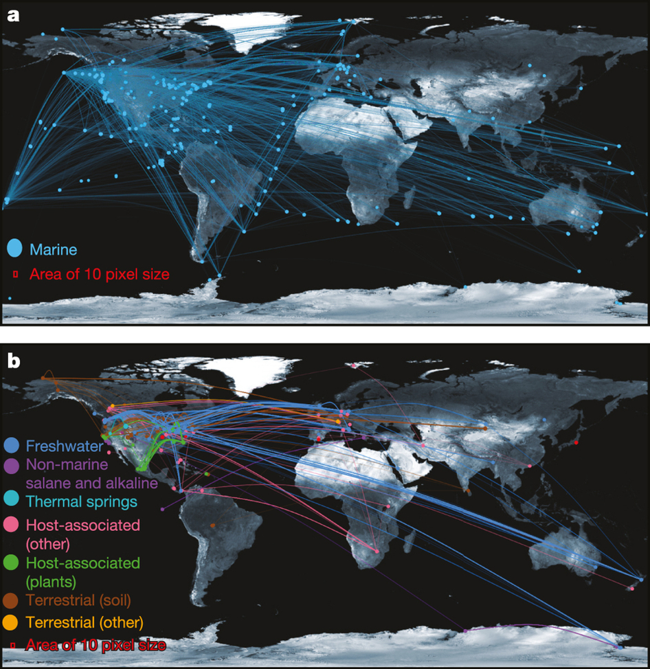

# Slides Online

- Source: [github.com/ericmjl/uncovering-earths-virome][source]
- PDF: [ericmjl.com/uploads/uncovering-earths-virome.pdf][pdf]

[pdf]: http://www.ericmjl.com/uploads/uncovering-earths-virome.pdf
[source]: http://github.com/ericmjl/uncovering-earths-virome

# Motivating Questions

- How many viruses are out there?
- How can we discover them if we can't grow them?

# Data Source and Processing

- Publicly available metagenomic data sets from the IMG/M system.
    - 1,729 environmental samples
    - 1,079 host-associated samples
    - 234 engineered samples

Engineered: originating from the "built environment"; check "MicroBENet".

# Data Source and Processing

## Problem:
- No universal markers.

## Solution:
- Leverage what we know: Protein families from 1,800 manually identified metagenomic viral contigs.

# Metagenomic mining expands diversity of known viruses

- Use known viral sequences and 

# Metagenomic mining expands diversity of known viruses

# Host-virus interactions mapped by data integration

- Viral "Groups": Project known host-virus interactions.
- CRISPR-Cas: identify virus-prokaryote pairings.
- Viral tRNA: match to host genomes.

This is the one place where I think the paper uncovers new biology.

# Expanded view of host-virus interactions

# CRISPR spacers targeting same virus found on disparate phyla

# Viral distribution is clustered according to habitat

# Viruses can be found basically all known environments

# Viruses are shared between geographical locations

