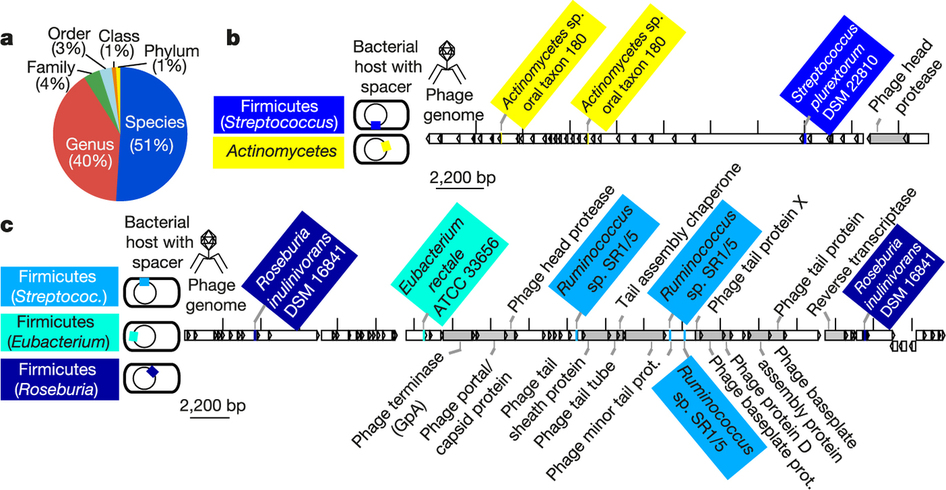

# Slides Online

- [source]
- [slides]

[source]: http://www.github.com/ericmjl/uncovering-earths-virome
[slides]: http://ericmjl.github.io/uncovering-earths-virome/slides.html

# IMED 2016

> - 21st century disease emergence is accelerating, driven by population growth and related impact on the environment
> - The world is still ill-prepared to respond to an emerging threat
> - **Our capacity to deploy effective “counter measures” is limited by what we “don’t know” about future threats**
> - Success will require changing from a culture that is “reactive” to one that is “proactive”
> - We live in an age of Big Data which allows us to think differently about problems and solutions
> - The Global Virome Project is about Big Data making a Big Impact

# Motivating Questions

## Metagenomics lets us answer these questions:

> - How many viruses are out there?
> - How can we discover them if we can't grow them?

# Data Source and Processing

- Publicly available metagenomic data sets from the IMG/M[^imgm] system.
    - 1,729 environmental samples
    - 1,079 host-associated samples
    - 234 engineered samples

Engineered: originating from the "built environment"; check "MicroBENet[^microbenet]".

[^imgm]: Integrated Microbial Genomes with Microbial Samples
[^microbenet]: Microbiology of the Built Environment Network

# Data Source and Processing

## Problem:
- No universal markers, unlike barcode of life.

## Solution:
- Leverage what we know:
    - Protein families from 1,800 manually identified metagenomic viral contigs.
    - Known viral protein families from isolates.
- Use known viral sequences as bait

# Metagenomic mining expands diversity of known viruses

- Large Viruses
    - 596 kb contig, bioreactor
    - Circular genomes by end overlaps
    - 350-470 kb contig (6 samples)

# Metagenomic mining expands diversity of known viruses

{#fig1 .class height=450px}

# Host-virus interactions mapped by data integration

- Viral "Groups": Project known host-virus interactions.
- CRISPR-Cas: identify virus-prokaryote pairings.
- Viral tRNA: match to host genomes.

This is the one place where I think the paper uncovers new biology.

# Expanded view of host-virus interactions

{#fig2 .class height=450px}

# CRISPR spacers targeting same virus found on disparate phyla

{#fig3 .class height=450px}

# Viral distribution is clustered according to habitat

{#fig4 .class height=450px}

# Viruses can be found basically all known environments

{#fig5 .class height=450px}

# Viruses are shared between geographical locations

{#sfig10 .class height=450px}

# Paper Conclusions & Claims

- Metagenomics expands our view of the biosphere.
- Comprehensive map of host-virus interactions mined by combining datasets.

# Personal Thoughts

## On Influenza

- Influenza's host range is uniquely broad.

## On Incentives

- Incentives for this study and its publication would not be provided by search for therapies.
- Yet therapies will very likely come out of this.
